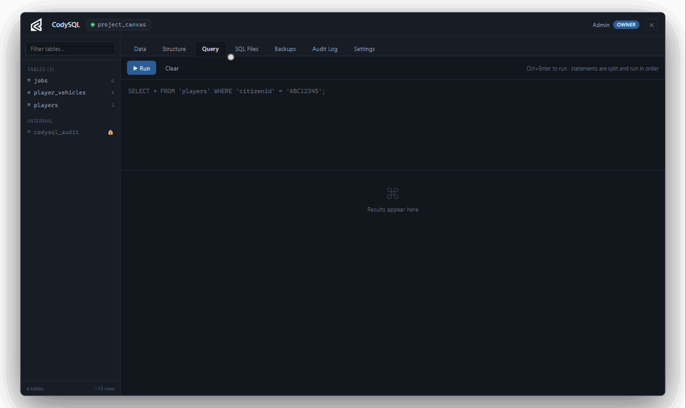
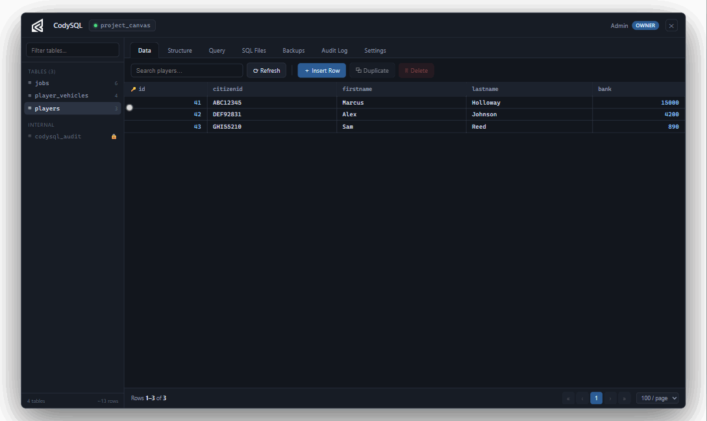
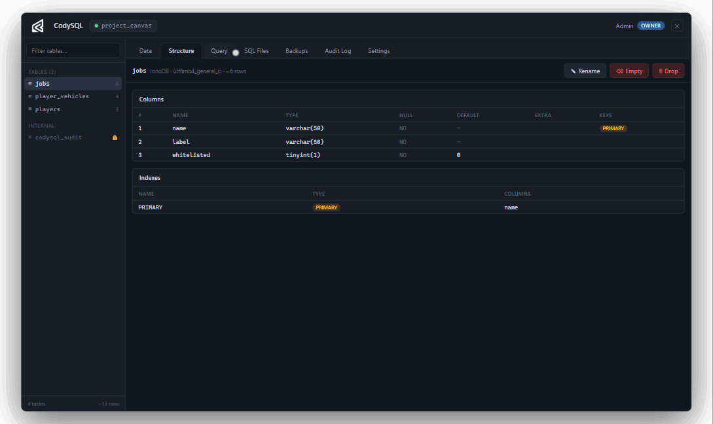
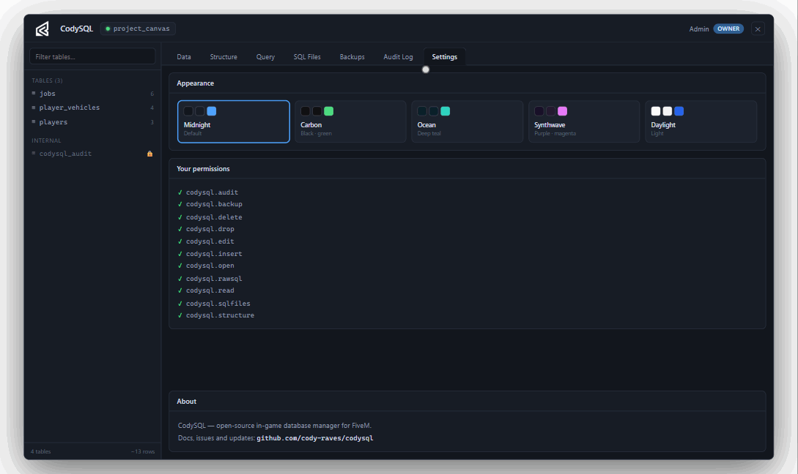
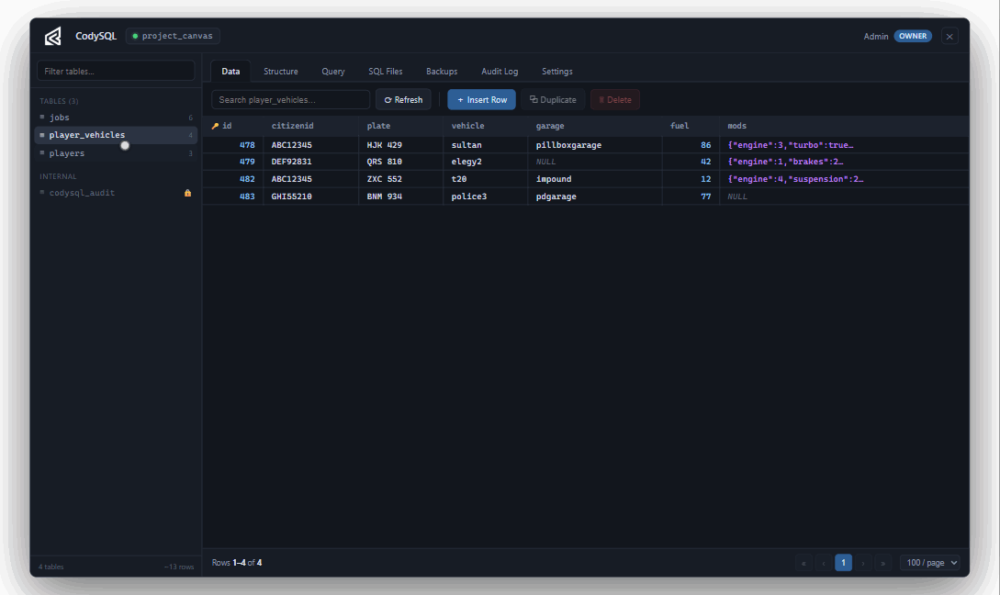

<p align="center">
  
</p>

<h1 align="center">CodySQL</h1>

<p align="center">
  <b>HeidiSQL, but inside FiveM.</b><br>
  Browse, edit, and query your server's live database without ever leaving the game.
</p>

---

## What is this?

You install a new script. The README says *"run the included SQL and add your job to the jobs table."* Normally that means: alt-tab out, open HeidiSQL, connect, find the table, edit, tab back in, test.

With CodySQL that whole loop happens in-game:

```
/codysql → SQL Files → run the installer → jobs table → Insert Row → done
```

CodySQL is a generic MySQL/MariaDB manager. It discovers your tables dynamically — it doesn't care whether you run QBCore, ESX, or something homemade.

**Free and open source. No escrow, no obfuscation.**

## See it in action

| | |
|---|---|
| **Run queries** — live syntax highlighting, per-statement results |  |
| **Edit data** — double-click any cell, see the SQL before it runs |  |
| **Drop tables safely** — typed confirmation, everything audited |  |
| **5 themes** — hover to preview, click to keep |  |
| **Make it yours** — resizable sidebar, remembered between sessions |  |

*(GIFs are recorded from the browser dev preview with mock data — regenerate them anytime with `cd web && npm run gifs`.)*

## Features

- 📋 **Table browser** — every table, live data, server-side pagination, search, sort
- ✏️ **Editing** — double-click a cell to edit it, full row insert/duplicate/delete, with the generated SQL shown before you commit
- 🧾 **JSON editor** — long values open in a dedicated editor with validation, format, and minify
- ⌨️ **Raw SQL** — multi-statement query editor with history and per-statement results
- 📂 **SQL file runner** — drop `.sql` files into `codysql/sql/` and execute them from the UI, sequentially or as a transaction
- 🕵️ **Audit log** — every action is recorded: who, what, old value, new value, when
- 💾 **Backups** — one-click full-database dump to a single `.sql` file, streamed to disk in chunks
- 🎨 **5 themes** — Midnight, Carbon, Ocean, Synthwave, Daylight
- 🔒 **Strict ACE permissions** — every action is permission-checked server-side, every time

## Requirements

| Dependency | Notes |
|---|---|
| [oxmysql](https://github.com/CommunityOx/oxmysql) | The only hard dependency |
| MySQL 5.7+ / MariaDB 10.3+ | Whatever your server already uses |

## Installation

1. Download the [latest release](https://github.com/cody-raves/CodySQL/releases) (or clone and build — see [Contributing](CONTRIBUTING.md)).
2. Put the `codysql` folder in your server's `resources/`.
3. Add to your `server.cfg`, **after** oxmysql:

```cfg
ensure oxmysql
ensure codysql
```

4. Grant yourself permissions (see [docs/permissions.md](docs/permissions.md) for the full list):

```cfg
# Full access for the owner — replace with your license identifier
add_ace identifier.license:YOUR_LICENSE_HERE codysql.open allow
add_ace identifier.license:YOUR_LICENSE_HERE codysql.read allow
add_ace identifier.license:YOUR_LICENSE_HERE codysql.edit allow
add_ace identifier.license:YOUR_LICENSE_HERE codysql.insert allow
add_ace identifier.license:YOUR_LICENSE_HERE codysql.delete allow
add_ace identifier.license:YOUR_LICENSE_HERE codysql.rawsql allow
add_ace identifier.license:YOUR_LICENSE_HERE codysql.structure allow
add_ace identifier.license:YOUR_LICENSE_HERE codysql.drop allow
add_ace identifier.license:YOUR_LICENSE_HERE codysql.sqlfiles allow
add_ace identifier.license:YOUR_LICENSE_HERE codysql.audit allow
add_ace identifier.license:YOUR_LICENSE_HERE codysql.backup allow
```

5. Restart, join, and run `/codysql`.

> **Tip:** find your license identifier in the server console when you connect, or via `status` in txAdmin.

### Giving limited access to other staff

A support admin who should only *look* at data:

```cfg
add_ace group.admin codysql.open allow
add_ace group.admin codysql.read allow
add_ace group.admin codysql.audit allow
```

They'll see the UI with everything else locked. The server enforces this on every request — the UI locks are just a courtesy.

## How it works (the short version)

```
NUI (React) → client event → SERVER: permission check → validate identifiers → oxmysql → database
```

- CodySQL uses **your existing oxmysql connection**. It never sees or stores database credentials, and never sends anything database-related to the client except query results.
- Table and column names from the UI are only accepted if they match the **discovered schema** — you can't inject an identifier that doesn't exist.
- All values are **parameterized**. The audit log records everything, including denied attempts.

More detail in [docs/security.md](docs/security.md).

## The SQL file runner

Put files in `codysql/sql/`:

```
codysql/sql/
├── example-install.sql
├── my-new-script.sql
└── housing-update.sql
```

Open **SQL Files** in the UI, pick a file, review its contents, execute. Statements are split with a real parser (quotes, comments, and semicolons-in-strings are handled). Each run is stored in the audit log with the exact SQL that was executed.

> Files are discovered through FiveM's sandboxed `io.readdir()` resource-directory API. CodySQL never executes operating-system commands and never loads code from remote sources. If `io.readdir` is unavailable on your build, create `sql/_index.txt` with one filename per line and CodySQL will use that instead.

## Backups

**Backups → Create Backup Now** writes a complete dump (schema + data) to `codysql/backups/manual/`, streamed in chunks so big databases don't spike memory.

Honest limitations, so you can plan around them:

- **Restore is not in-game yet.** Restoring on a live server is dangerous (frameworks cache data in memory and write it back over your restore). For now: stop the server, import the `.sql` with your normal tools, start the server. In-game restore with proper guardrails is on the roadmap.
- Backups live on the same machine as the database. They protect you from bad edits and bad scripts — not from losing the whole server. Copy important backups somewhere else.

## Roadmap

- [ ] Scheduled automatic backups with current/previous rotation
- [ ] Guarded in-game restore (owner PIN, typed confirmation, empty-server requirement)
- [ ] Column & index editing (add/modify/drop columns from the Structure tab)
- [ ] Foreign-key jump (click a `citizenid`, land on that player's row)
- [ ] Auto-refresh with cell change highlighting

## FAQ

**Does this work with QBCore / ESX / custom frameworks?**
Yes — CodySQL doesn't know or care what framework you run. It reads the schema from the database itself.

**Can players open this?**
Only if you give them `codysql.open`. Don't. Every action additionally requires its own permission, enforced server-side.

**Why is a table read-only?**
It has no primary key. Without one there's no safe way to target a single row. Add a primary key and it becomes editable.

**Where's mysql-async / ghmattimysql support?**
Both are effectively unmaintained; oxmysql is the community standard. Adapters could be added if there's real demand.

## License

[MIT](LICENSE) — do what you want, no warranty. If you build something cool on top of it, a link back is appreciated.
